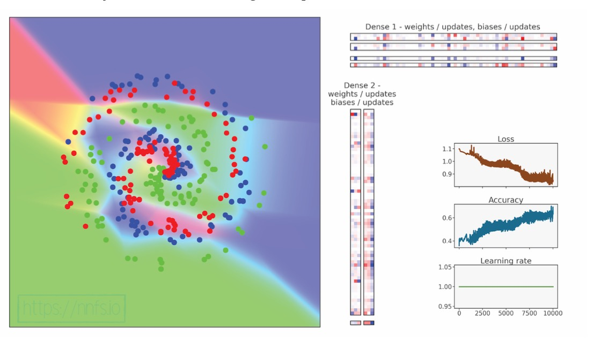
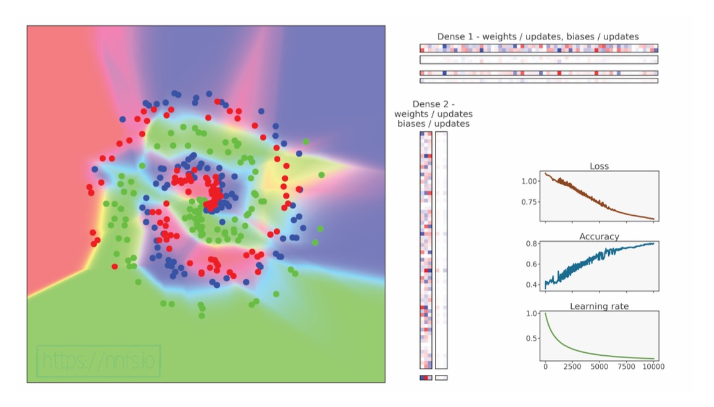
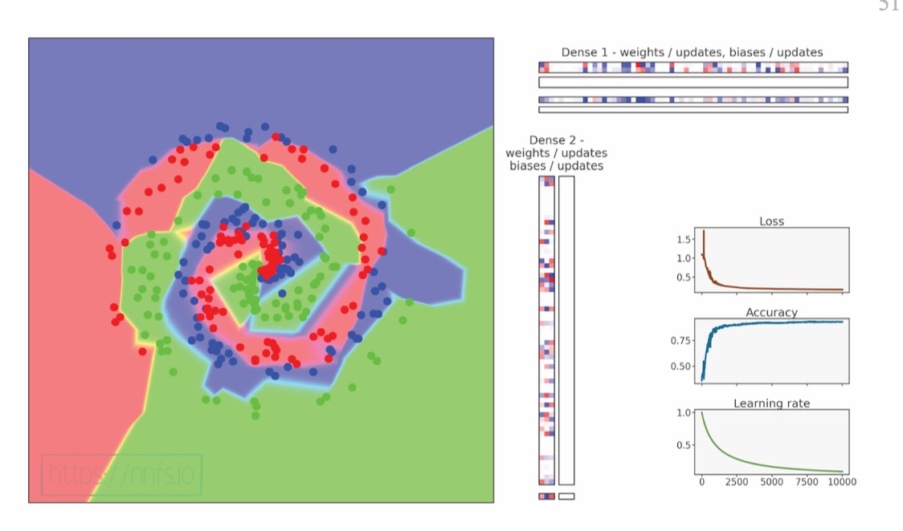

# Bare Metal Neural Network

This is a bare-metal implementation of neural networks. I decided to take on the challenge of building my own neural network from scratch—no libraries, no frameworks, no shortcuts. Raw Python. Pure math. One line at a time. Constructed without external libraries. By building each component from the ground up, I've aimed to demystify the workings of neural networks and provide a transparent view of their mechanics.

> *Sometimes, it's easier to think of a vector not as a point in space, but as the physical embodiment of a linear transformation.*  
> ~ [3Blue1Brown](https://www.3blue1brown.com/)

## Technical Overview

- **Pure Python Implementation**: The entire neural network is developed using Python, ensuring clarity and simplicity in understanding the foundational concepts.
- **NumPy Integrati``on**: While the core implementation avoids third-party libraries, NumPy is incorporated in later stages to enhance numerical computations and performance.
- **Modular Design**: The project is structured into distinct modules, each representing a fundamental aspect of neural networks, including:
  - **Neurons and Layers**: Basic building blocks of the network.
  - **Activation Functions**: Implementations of various activation mechanisms.
  - **Loss Calculations**: Methods to evaluate network performance.
  - **Backpropagation**: Algorithm for training the network through error correction.
  - **Optimization Techniques**: Strategies to improve learning efficiency.

## Pre-Requisites

```
pip install numpy
```

## Walk-through

The best way to understanding the inner workings of a neural network is by running through an example. Let us do so.

### Back Propagation

However, before we do, it is important to understand back-propagation. And, back-propagation is complex. So let us begin by a fake example of back-propagation. Minimizing the output of one neuron, which is going to take one input, of 3 features.

#### Single Neuron Computation

The code here is found in `one_neuron_backprop.py`
This neuron takes one input sample with 3 features (`x[0]`, `x[1]`, `x[2]`) and uses 3 corresponding weights (`w[0]`, `w[1]`, `w[2]`) to compute the output. The neuron performs:

1. **Three multiplications**:
   - `p_0 = x[0] * w[0]`
   - `p_1 = x[1] * w[1]`
   - `p_2 = x[2] * w[2]`

2. **One addition** (including the bias `b`):
   - `z = p_0 + p_1 + p_2 + b`

3. **ReLU activation**:
   - `Output = max(0, z)`

This completes a full forward pass. The derivatives with respect to the weights and bias will indicate their influence and will be utilized to adjust these weights and bias.

To find the derivative with respect to a single input, say `x_0`, we do,

`(dReLU / dsum) * (∂sum / ∂mul(x0, w0)) * (∂mul(x0, w0) / ∂x0)`

Let us assume here that the neuron has a gradient of 1 from the next layer. This means that

- The derivative of the cost wrt the relu activation is 1. The impact of the neuron on the cost is 1.
- Relu's derivative is 1 if input>0, else 0. Here, z is 6, so derivative of Relu is 1.
- So, chain rule, the impact of the z on the cost is 1.
- Knowing that the effect of the weights on z = input, and the effect of inputs on z is the weights
- We can know exactly what the partial derivative of dcost_dw is. It's simply dz_dw x drelu_dz x dcost_drelu where dz_dw is simply the input feature matrix
- Why do dcost_dinput? This helps us know how much we want to reduce the inputs that we were fed, the activations of the previous layer.

Ok...so that was easy enough. But its useless honestly. Why reduce the relu output of one neuron. Ok, fair enough. Let's up it one notch. Let's set a list of 3 samples for input. Each sample has 4 features. We're talking

#### Multiple Neuron Computation

The code here is found in `multiple_neurons_backprop.py`

This example will use 3 input samples, each with 4 features (`x[0]`, `x[1]`, `x[2]`, `x[3]`) and 4 corresponding weights (`w[0]`, `w[1]`, `w[2]`, `w[3]`) per neuron.

The network can therefore be treated as the following. A 4-neuron input layer, where each neuron corresponds with an input feature, that will be fed 3 samples. Thus, the first matrix is a 3x4. The second hidden layer is a 4x3. That is, it has 4 weights per neuron, and 3 neurons total. The final layer is then just one neuron, taking in a 3x3 matrix, so it must have 3 weights, for a final matrix output of 3x1.

So the inputs for the first layer looks like

```python
[
   a, b, c, d
   e, f, g, h
   i, j, k, l
]
```

and the weights of the hidden layer will look like

```
[
   a d i
   b f j
   c g k
   d h l
]
```

 and the final layer

 ```
[
   a
   b
   c
]
```

Let's focus on the input layer and hidden layer. Let's focus on the 1st neuron of the input layer and hidden layer. The 1st neuron will receive, during backprop, a vector of 4 values from the hidden layer. The gradient, the list of partial derivatives, the weights. We need to sum this value, since we can only have one final nudge to use against the activation of this neuron.

What about the list of all neurons in the input layer? Well, we know that each neuron in the hidden layer outputs a gradient of partial derivatives with respect to its inputs. That is, the weights. We also know the weights are transposed. So we sum the rows since the weights are of the form

```
[
   w_00 w_01 w_02
   w_10 w_11 w_12
   w_20 w_21 w_22
   w_30 w_31 w_32
]
```

where for w_xy, the x is the neuron in the previous layer, and y is the neuron in the current layer.
As a result, we need to sum -> row-wise. That is, w_00 + w_01 + w_02, so that we can have the overall dC_dactivation of the, 0th neuron in the previous layer.

But do we just sum the weights and call it a day? Ofc not. We don't just want dz/dx=w. Instead, we want dC/dx, which is dC/dz * dz/dx. Hence, we have to multiply the weights (row-side) by the gradients that the hidden layer received. This is doable because there's one derivative per neuron, and one associated weight per neuron.

The one thing we have yet to account for is a batch of samples. That is, above would work for if we had only one sample.
In that scenario, we need only multiply the gradients generated by that sample for each neuron in our hidden layer, by the respective weights associated to each neuron in the previous layer, and sum everything up to get the final answer.

But with more samples, the hidden layer will return a list of gradients, a list of lists. Each list associated with one sample. So now what? Intuition would have you summarize the process of one sample:

```python
np.dot(dvalues, weights.T)
#The output of which is a list of nudges, the gradient, of the cost wrt each neuron 
[dc/dn1, dc/dn2, dc/dn3]
#and if theres multiple samples, we'll have
[dc1/dn1, dc1/dn2, dc1/dn3]
[dc2/dn1, dc2/dn2, dc2/dn3]
[dc3/dn1, dc3/dn2, dc3/dn3]
...
#each row represents the derivative, the nudge, of the cost wrt the neuron in the previous layer, for that row#'s sample
```

In fact, if theres multiple rows due to multiple samples, np.dot also takes care of that. It will generate a matrix of gradients for each sample. What must we do then? Collapse this matrix, column wise, since we want to have just ONE gradient per neuron. But, we don't need to do that...yet. This is done only at the very end. For now, we are happy with keeping it separate for each sample.

What about calculating gradients with respect to the weights? The dc/dw of the hidden layer? Well, we know that dc/dw = dc/dz * dz/dw, where dz/dw is just the activation from the previous layer, or the inputs.

So in a world where

```python
[
   [dc0/dn0, dc0/dn1, dc0/dn2], 
   [dc1/dn0, dc1/dn1, dc1/dn2],
   [dc2/dn0, dc2/dn1, dc2/dn2]
]
#where for dcx/dny x is the sample number, and y is the neuron's number. 
```

the above matrix is the gradient matrix of the cost wrt the neuron, we want to find a way to multiply each neuron's gradient by the input. So, hard-coded to find dc0/dw0, we would do dc0/dn0 * dn0/dw0, which is just the activation of the 0th neuron in the input layer. We note that inputs are of the form:

```python
[
   [a_00, a_01, a_02, a_03],
   [a_10, a_11, a_12, a_13],
   [a_20, a_21, a_22, a_23]
]
```

so in effect:
I would want to do `dc/dn x dn/dw = dc/dw`, or a_00*dc0/dn0   + a_10*dc1/dn0 + a_20 * dc2/dn0 to get the overall change to the w_1 of the first neuron, and so on. That is, I want a final matrix of

```python
[
[a_00*dc0/dn0+a_10*dc1/dn0+a_20*dc2/dn0,a_00*dc0/dn1+a_10*dc1/dn1+a_20*dc2/dn1,a_00*dc0/dn2+a_10*dc1/dn2+a_20*dc2/dn2],
[a_01*dc0/dn0+a_11*dc1/dn0+a_21*dc2/dn0,a_01*dc0/dn1+a_11*dc1/dn1+a_21*dc2/dn1,a_01*dc0/dn2+a_11*dc1/dn2+a_21*dc2/dn2],
[a_02*dc0/dn0+a_12*dc1/dn0+a_22*dc2/dn0,a_02*dc0/dn1+a_12*dc1/dn1+a_22*dc2/dn1,a_02*dc0/dn2+a_12*dc1/dn2+a_22*dc2/dn2],
[a_03*dc0/dn0+a_13*dc1/dn0+a_23*dc2/dn0,a_03*dc0/dn1+a_13*dc1/dn1+a_23*dc2/dn1,a_03*dc0/dn2+a_13*dc1/dn2+a_23*dc2/dn2]
]
```

which is literally just me saying I want a 4x3 matrix, given a 3x4 input matrix and 3x3 activations matrix:
dweights= np.dot(inputs.T, dinputs (the passed in vector from the next layer))

I mean think about it. All that does is say multiply the activation of neuron 1, layer 1 (this is the derivative of output of neuron 1, layer 2, wrt weight_1), by the derivative of cost wrt the output of neuron 1, layer 2, summed up for all samples, to get the overall derivative of cost wrt the weight 1 of neuron 1, layer 2. Repeat this for all weights ->, for all neurons ... simple enough.

```py
np.dot((activations.T), dvalues)
#where dvalues here are just the derivative of the cost with respect to the output of the neurons in the layer for whose weights #we are doing all this
```

### Loss Function and Back Prop

I used a Categorical Cross-Entropy Loss function, not a MSE loss function. Why? Because this is not a regression NN, this is a classification network. It's outputting a probability distrbution. CCE is used for comparing ground truth probability to predicted probability. Basically, it's the total sum of y_{i,j}*log(y_hat_{i,j}) for all j's (all neurons in the output layer), for one i, or one sample. Noting that the ground truth is 1 for only one neuron, and zero for the rest, the summation can be shortened into L_i= -log(y_hat_i,k), where k is the index of the true probability. Why -? Well, assuming that the base of the log is e, the ln(1)=0, or 0 loss for a 100% certainty. Everything lower than 1, is punished...severely, with a negative number. ln(0) is a loss of, negative infinity. So loss must be multiplied by a negative factor in order to make sense. This is especially true when the final output layer has a SoftMax Activation. That is:
$$
\sigma(z)_i = \frac{e^{z_i}}{\sum_{j=1}^{n} e^{z_j}}
$$
so that the total outputs of all the neurons' sum is 1.

and the derivative of the CCE loss function, given that it's just -1 x y x log(y_hat), is -y/y_hat.

### Activation Functons and Backprop

The derivative of the relu activation function is just one for all outputs >0 , and 0 else. But what about the last layer's activation, the softmax activation?

The softmax activation is just e^ij / sum of e^ij for all j's of an ith sample. How do we find the derivative of this, with respect to e^ik?

Basically, we will do a bunch of derivatives, for two cases, one for when j=k, one for when j!=k. We end up with
the derivative of S_ij, the probability output for the j_th class of the i_th sample, with respect to z_i,j, the raw logit (probability) score of the jth class of the ith sample, is:
dS_ij/dz_ik= S_ij(1-S_i,k) for j=k
dS_ij/dz_ik= S_ij(0- S_i,k)for j!=k

And given a delta function δ_ij=1 for j=k, else 0, we can write this in one line as
dS_ij/dz_ik=S_ij(δ_ij-S_ik)

It is important to note, that the SoftMax function is a function that takes in vector inputs, and instead of outputting a single output (that way, it's just a gradient), it actually gives a vector output.

```py
z=[1,2,3]
s=[e^1/(e^1+e^2+e^3), e^2/(e^1+e^2+e^3), e^3/(e^1+e^2+e^3)]
```

As such, this function doesn't have a gradient, it has a jacobian. I'm not going to fully explain what the jacobian matrix is in this README, because it has been explained online by people orders of magnitude more intelligent than myself, but I'll try to give a quick summary.

In the above case, the ds/dz, the derivative of the softmax with respect to the output will be nothing other than:

```py
[
   [ds1/dz1, ds1/dz2, ds1/dz3],
   [ds2/dz1, ds2/dz2, ds2/dz3],
   [ds3/dz1, ds3/dz2, ds3/dz3]
]
#And so, to give these numbers, let us suppose that the outputs, s, are 
s=[0,7, 0.1, 0.2]
#Then, the derivate dSj/dZk being equal to Sj*(1-Sj) if j=k
#                                          Sj*(0-Sk) if j!=k
'''
   [dS1/dz1, dS1/dz2, dS1/dz3],
   [dS2/dz1, dS2/dz2, dS2/dz3],
   [dS3/dz1, dS3/dz2, dS3/dz3]
'''
[
   [0.7,  0,    0 ],
   [0,    0.1,  0 ],
   [0,    0,    0.2]
]
# - 
[
   (0.7*0.7), (0.7*0.1), (0.7*0.2)],
   [(0.1*0.7), (0.1*0.1), (0.1*0.2)],
   [(0.2*0.7), (0.2*0.1), (0.2*0.2)
]
#to get above, we simply do np.dot(s.reshape(-1,1), s.T)
# to eventually get this
[
   [0.7-(0.7*0.7), 0-(0.7*0.1), 0-(0.7*0.2)],
   [0-(0.1*0.7),    0.1-(0.1*0.1),  0-(0.1*0.2)],
   [0-(0.2*0.7),    0-(0.2*0.1), 0.2-(0.2*0.2)]
]
```

Check out the backprop classes of the activation functions for more detail.

### A smart thing

Was all the above necessary? I mean, none of this is necessary. We could've just done
`import tensorflow as tf`
or better yet, not do anything.

In any case, the answer is no. We KNOW that the softmax activation layer is going to be used only for the last layer, and that it *will* be followed by a categorical cross entropy loss function. So why not combine the two functions, and take the derivative of cost wrt the 2 combined functions, cutting out the middle man? I mean, we know they're going to be chained together anyways.

The math is simple really. We try to do dC/dz_ik= dC/dSxdS/dz, where s is y_hat. So we end up with dC/dy_hat x dy_hat/dz. We know that dc/dy_hat= derivative of -ylog(y_hat) summed over all j columns  = y/y_hat summed over all j columns. We know that dS/dz is S_ij x (1-S_ij) if j=j and S_ij*(-S_ij) otherwise. We multiply the two together, do math, and the final answer, the final derivative, the final

dL_i/dz_ik = y_hat_ik - y_ik

THIS IS INSANE. THIS IS LITERALLY INSANE. ALL THAT WORK WE DID, WAS FOR NOTHING, no I'm just kidding. But really, given that the softmax activation function is literally stuck to the categorical cross entropy loss, just combine the 2 layers, and the derivative with respect to the straight z outputs of the neurons in backprop is just y_pred-y_true. Boom. Multiple times faster to compute. Literally so easy.
If you don't believe this (I don't blame you, who am I to tell you what is and isn't true), run `testing.py`. The final dvalues is the same
for both. The math, is clear.

## Optimizers

### Stochastic Gradient Descent (SGD)

This is just a rudimentary optimizer. Decrease the loss by using the calculated gradient to update the weights and biases of the neural network. It takes in a batch of data, and that batch could be 1 sample, or every sample.

Hyperparameters are tunable parameters in machine learning models and optimization algorithms that are set before training begins
Check out `experiments/optimizing.py` for a very basic implementation of a fully connected neural network. There, we use the optimizer to train a 1x64 densely connected neural network.

The structure is basically an input layer, 300x2, fed into a hidden layer of 2x64, fed into an output layer of 64x3 (3 classes).

```py
            Input Layer       Hidden Layer            Output Layer
 300            O                O                       O
 samples        O                O                       O
 ->                              O                       O
                                 O
                                 O
                                 .
                                 .   (64 neurons total)
                                 .
                                 O
                                 O
                                 O
                                 O
```

Training a neural network involves performing forward and backward passes, followed by optimization, over multiple epochs. An epoch is a complete pass through the training data. The goal is to adjust weights and biases to minimize the loss function. Ideally, this would be achieved in one epoch, but typically multiple epochs are needed.

For implementation details, see `experiments/optimizing.py`, but the output should be

```py
epoch: 0,loss: 1.099,accuracy: 0.360
epoch: 10000,loss: 0.860,accuracy: 0.600
```

so we know that, despite the pathetic performance, the network has been trained succesfully. I rest my case...not. There's much to do.
the rule of thumbs is this: If the loss value is NOT 0, or not very close to 0, but the model stopped learning (accuracy stopped increasing), then we're stuck at a local minimum.
Training a model multiple times with different initializations does work and increases your chances of finding the global minimum (or a good enough local minimum). However, it's expensive.
So what do we do?

Well, originally we used to do
w_(t+1)= w_(t)-l*g(w_t)
so new weight = current weight - learning rate* gradient of loss function wrt current weight (direction of steepest ascent)

```py
weights = weights - learning_rate * gradients
```

What if instead we did:

```py
velocity = momentum * velocity - learning_rate * gradients
weights = weights + velocity
```

So, assuming the first ever velocity starts with a value of 0, and momentum is usually something like 0.9. So what will happen is that weights = weights - learning_rate * gradient. Velocity itself then becomes = - learning_rate*gradient.
In the next iteration, velocity will become 0.9*prev_velocity - learning rate times the gradient. Here, if the gradient is 0, we still go in the direction of velocity, just at 0.9x the previous rigor.

- If the learning rate is too small, training is slow, and it'll take alot of steps to get to where we want to go.
- Most times, you need a low learning rate and high momentum.
- If the learning rate is set too high, the model might not be able to find the global minimum

A large learning rate can cause a gradient explosion. Causing the output to rise with each step, eventually hitting the floating point limit, and stopping the training.

Usually, we will want to start with a large learning rate, and then decrease the learning rate over time. So we use a learning rate decay.
To overcome local minimas, we'll use momentum. Both implementations found in `optimizers.py`. But one can see the effect of
vanilla sgd, vs sgd with decay and momentum, as follows:

<div style="display: flex; justify-content: center; align-items: center; gap: 20px;">
  
  
  
</div>

We also include the code for ADAM optimizers, as well as techniques for L1 and L2 regularization, and Dropout. Only a summary of each will be provided here.

1- AdaGrad : Normalize the updates made to the features. So if we pushed the gradient of one parameter too much, then it doesn't get as changed. The bigger the sum of the updates is to a parameter, the smaller updates are made in future training. By letting less frequently updated parameters more updated, we let more neurons get used for training.

```py
cache+=(param_gradient)**2
param_update= lr* param_gradient/(sqrt(cache)+epsilon)
```

2- RMS Prop: Similar to AdaGrad, except the cache is calculated differntly. It is

```py
cache=rho*cache + (1-rho)*(param_gradient)**2
param_update=lr*param_gradient/(sqrt(cache)+epsilon)
```

3- Adam: Adaptive Momentum. Most commonly used optimizer. It uses RMS Prop, but also adds the idea of momentum. So there's a 'momentum' idea for cache, beta2, and momentums of weights, beta1. With the understanding that

```py
cache= beta2*cache + (1-beta2)*(param_gradient)**2
cache_corrected=cache/ \
               (1-(beta2^(steps+1)))
#and weight updates being
param_update= beta1*param_update + (1-beta1)*(param_gradient)
praram_update_corrected= param_update/\
                        (1-(beta1^(steps+1)))
param+= -lr * praram_update_corrected/(sqrt(cache_corrected)+epsilon)
```

## Acknowledgments

This project is inspired by the book Neural Networks from Scratch in Python by Harrison Kinsley and Daniel Kukieła. Their work provided a foundational understanding and motivated the development of this hands-on implementation. The math intuition would not have been possible without the great work of 3B1B.
